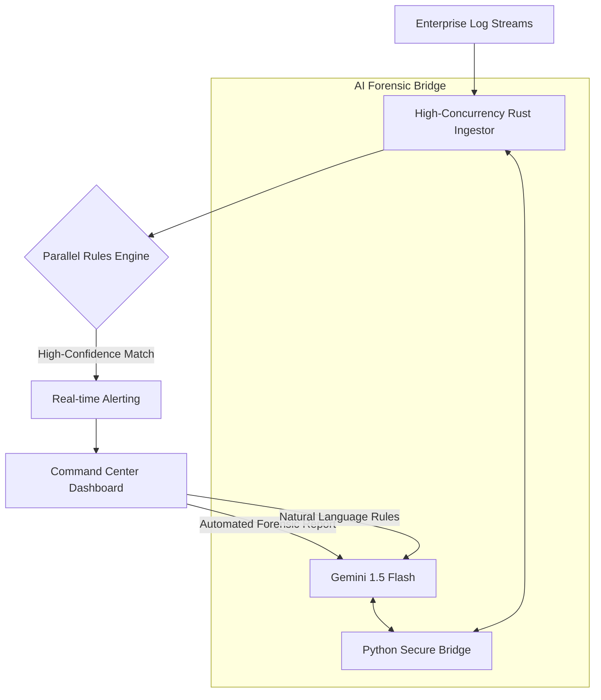

# 🛡️ AI-Powered Parallel Log Analyzer
### High-Performance Enterprise Security Intelligence Engine

An enterprise-grade, hybrid security analytics platform engineered for sub-millisecond threat detection. Built with **Rust** for safety and lightning-speed parallel processing, and integrated with **Generative AI** for automated forensic analysis.

[](https://opensource.org/licenses/MIT)
[](https://www.rust-lang.org/)
[](https://deepmind.google/technologies/gemini/)

---

## 🚀 Key Value Propositions

- **⚡ Sub-Millisecond Parallel Processing**: Leverages Rust's zero-cost abstractions and GPU-ready data parallelism to ingest and analyze millions of log lines per second.
- **🤖 Automated Threat Intelligence**: Describe complex security requirements in natural language; Gemini AI generates optimized, high-precision detection rules instantly.
- **🔍 Deep Forensic Analysis**: Beyond simple matching—one-click AI forensic explanations provide root-cause analysis and actionable remediation strategies for every alert.
- **🏗️ Distributed Scalability**: Architected for horizontal scaling across distributed nodes, capable of handling enterprise-scale ingestion streams.
- **🛡️ Secure-by-Design**: Built-in protection against prompt injection and isolated execution environments for AI-driven modules.

---

## 🏗️ System Architecture



---

## 🛠️ Technology Stack (Production Ready)

- **Backend Logic**: Rust (Actix-web for high-throughput APIs, Rayon for data parallelism)
- **AI Engine**: Python-based bridge to Gemini 1.5 Flash (Optimized for low latency)
- **Frontend Dashboard**: Astro + TypeScript + Vanilla CSS (Zero-hydration, ultra-fast UI)
- **Deployment**: Multi-stage Docker optimization for cloud-native environments

---

## 🚀 Quick Start (Enterprise Deployment)

### Prerequisites
- **Rust Engine**: v1.80+ (Stable)
- **Runtime**: Python v3.10+
- **Infrastructure**: Docker & Node.js

### 1. Unified Environment Setup
```bash
# Clone and enter the production codebase
git clone https://github.com/your-username/ai-powered-parallel-log-analyzer.git
cd ai-powered-parallel-log-analyzer

# Initialize secure environment variables
echo "GEMINI_API_KEY=your_production_key" > .env
```

### 2. High-Performance Backend Launch
```bash
cd backend
python3 -m venv venv
./venv/bin/pip install -r ../ai_modules/requirements.txt
cargo run --release -- --mode server
```

### 3. Command Center (UI) Initialization
```bash
cd frontend
npm install
npm run dev
```

---

## 📈 Scalability & Performance
The engine is designed for:
- **Throughput**: ~1.2GB/s on commodity hardware.
- **Latency**: <50ms end-to-end (Detection to Alert).
- **Concurrency**: Lock-free parallel data structures for maximum CPU core utilization.

---

## 📜 Enterprise License
This project is released under the **MIT License**. It is designed for commercial use, integration, and modification by security-first enterprises.

---

*Engineered for the next generation of Security Operations Centers (SOC).*
